<div align="center">

# cyberpower-exporter

[](https://github.com/SimplicityGuy/cyberpower-exporter/actions/workflows/build.yml)


[](https://github.com/astral-sh/uv)
[](https://github.com/astral-sh/ruff)
[](https://github.com/pre-commit/pre-commit)
[](http://mypy-lang.org/)
[](https://github.com/PyCQA/bandit)
[](https://www.docker.com/)
[](https://prometheus.io/)
[](https://claude.ai/code)

**A Prometheus exporter for CyberPower UPS systems — reads `pwrstatd` over a Unix socket and exposes battery, load, and power metrics on port 9200.**

</div>

<p align="center">

[🚀 Quick Start](#-quick-start) | [📊 Metrics](#-exported-metrics) | [⚙️ Configuration](#%EF%B8%8F-configuration) | [👨‍💻 Development](#-development) | [📜 Attribution](#-attribution)

</p>

## 🎯 What is cyberpower-exporter?

A single-purpose Prometheus exporter that talks to the CyberPower [PowerPanel](https://www.cyberpowersystems.com/products/software/power-panel-personal/) `pwrstatd` daemon over its Unix socket and translates the response into Prometheus metrics. It is shipped as a multi-arch (`linux/amd64`, `linux/arm64`) Docker image to GitHub Container Registry.

Drop it next to your UPS host, scrape `:9200/metrics`, and you get battery health, line voltage, load, and event signals without touching SNMP or the proprietary GUI.

## 🏛️ Architecture Overview

```mermaid
graph LR
    UPS[("🔋 CyberPower UPS")]
    PWRSTATD[["⚙️ pwrstatd"]]
    SOCK{{"📡 /var/pwrstatd.ipc"}}
    EXP[["📊 cyberpower-exporter"]]
    PROM[("🔥 Prometheus")]
    GRAF[["📈 Grafana / Alertmanager"]]

    UPS -->|USB| PWRSTATD
    PWRSTATD --- SOCK
    SOCK -->|STATUS command| EXP
    EXP -->|HTTP :9200/metrics| PROM
    PROM --> GRAF

    style UPS fill:#e1f5fe,stroke:#01579b,stroke-width:2px
    style PWRSTATD fill:#fff3e0,stroke:#e65100,stroke-width:2px
    style SOCK fill:#f3e5f5,stroke:#4a148c,stroke-width:2px
    style EXP fill:#e0f2f1,stroke:#004d40,stroke-width:2px
    style PROM fill:#ffebee,stroke:#b71c1c,stroke-width:2px
    style GRAF fill:#e8f5e9,stroke:#1b5e20,stroke-width:2px
```



The exporter polls `pwrstatd` every `POLL_INTERVAL` seconds, parses the `key=value` reply, and updates 11 Prometheus collectors plus an `Info` metric. The container runs as a non-root user added to the `root` group so it can read the host-owned `pwrstatd.ipc` socket.

## 🌟 Key Features

- **🐋 Multi-arch image**: `linux/amd64` + `linux/arm64`, published to `ghcr.io/simplicityguy/cyberpower-exporter`
- **🔒 Hardened container**: non-root user, healthcheck on `/metrics`, ready for `--cap-drop=ALL --security-opt=no-new-privileges:true`
- **📦 Reproducible builds**: uv-based multi-stage Dockerfile with a committed `uv.lock`
- **📝 Type-safe**: full type hints, strict mypy validation, Bandit security scanning
- **🪵 Structured logging**: [structlog](https://www.structlog.org/) with JSON output to stdout, ISO-8601 UTC timestamps, contextvars-merged service tag, and structured exception tracebacks
- **✅ Tested**: 13-test pytest suite with mocked Unix socket and isolated Prometheus registry
- **🤖 CI/CD**: code-quality + docker-validate + multi-arch build, monthly image cleanup, weekly scheduled rebuilds, Dependabot for actions, docker, and pip ecosystems
- **🏷️ OCI labels**: full `org.opencontainers.image.*` set populated from build args (date, version, revision, source, license, base image)

## 🚀 Quick Start

```bash
docker run -d \
    --name cyberpower-exporter \
    --restart unless-stopped \
    --cap-drop=ALL \
    --security-opt=no-new-privileges:true \
    -v /var/pwrstatd.ipc:/var/pwrstatd.ipc \
    -p 9200:9200 \
    ghcr.io/simplicityguy/cyberpower-exporter:latest

# Scrape it
curl http://localhost:9200/metrics
```

The host must be running `pwrstatd` (CyberPower [PowerPanel for Linux](https://www.cyberpowersystems.com/product/software/powerpanel-for-linux/)). The daemon's Unix socket at `/var/pwrstatd.ipc` must be mounted into the container.

### Prometheus scrape config

```yaml
scrape_configs:
  - job_name: cyberpower
    static_configs:
      - targets: ["ups-host:9200"]
```

## 📊 Exported Metrics

| Metric                       | Type  | Description                              |
| ---------------------------- | ----- | ---------------------------------------- |
| `ups_cyberpower_info`        | Info  | Model name and firmware number           |
| `ups_utility_volt`           | Gauge | Utility input voltage                    |
| `ups_output_volt`            | Gauge | UPS output voltage                       |
| `ups_load`                   | Gauge | Load percentage (0-1)                    |
| `ups_battery_capacity`       | Gauge | Battery capacity percentage              |
| `ups_battery_remaining_time` | Gauge | Battery time remaining (seconds)         |
| `ups_battery_charging`       | Gauge | Battery charging (0/1)                   |
| `ups_battery_discharging`    | Gauge | Battery discharging (0/1)                |
| `ups_ac_present`             | Gauge | AC power present (0/1)                   |
| `ups_diagnostic_result`      | Gauge | Last diagnostic result                   |
| `ups_input_rating_volt`      | Gauge | Input voltage rating                     |
| `ups_output_rating_watt`     | Gauge | Output wattage rating                    |

## ⚙️ Configuration

| Environment Variable | Default | Description                          |
| -------------------- | ------- | ------------------------------------ |
| `POLL_INTERVAL`      | `5`     | Seconds between UPS status polls     |
| `LOG_LEVEL`          | `INFO`  | Log level — `DEBUG`, `INFO`, `WARNING`, `ERROR`, `CRITICAL` |
| `LISTEN_ADDRESS`     | `0.0.0.0:9200` | Bind address (set by the image) |

The container runs as a non-root `exporter` user in the `root` group so it can read the host-owned socket. The exporter binds `0.0.0.0:9200` so it is reachable from outside the container.

### Log format

Logs are emitted as one JSON object per line on stdout, ready for ingestion by Loki, Fluent Bit, Vector, or Docker's `json-file` driver:

```json
{"event": "exporter started", "listen_port": 9200, "poll_interval": 5, "socket": "/var/pwrstatd.ipc", "service": "cyberpower-exporter", "level": "info", "logger": "cyberpower_exporter.exporter", "timestamp": "2026-05-01T18:11:35.735897Z"}
```

## 👨‍💻 Development

This project mirrors the [SimplicityGuy/discogsography](https://github.com/SimplicityGuy/discogsography) toolchain and uses **[uv](https://github.com/astral-sh/uv)** for Python dependency management.

### Setup

```bash
git clone https://github.com/SimplicityGuy/cyberpower-exporter.git
cd cyberpower-exporter
uv sync --all-groups          # Install runtime + dev deps into .venv
uv run pre-commit install     # Install git hooks
```

### Common commands

```bash
uv run cyberpower-exporter                           # Run the exporter (entry point)
uv run pytest                                        # Run the test suite (13 tests)
uv run pytest --cov=cyberpower_exporter              # With coverage report
uv run ruff check .                                  # Lint
uv run ruff format .                                 # Format
uv run mypy .                                        # Strict type checking
uv run bandit -c pyproject.toml -r src/              # Security scan
uv run pre-commit run --all-files                    # Full quality gate
docker build -t cyberpower-exporter:dev .            # Local image build
```

### Repository layout

```
src/cyberpower_exporter/      # Package: __init__.py, exporter.py, py.typed
tests/                        # pytest suite with mocked Unix socket
.github/actions/              # setup-python-uv composite action
.github/workflows/            # build.yml, cleanup-cache.yml, cleanup-images.yml
.github/dependabot.yml        # github-actions, docker, pip ecosystems
pyproject.toml                # ruff/mypy/bandit/pytest config + uv environments
uv.lock                       # Pinned dependencies (committed)
Dockerfile                    # uv-based multi-stage build
```

### Quality standards

| Tool          | Purpose                                       |
| ------------- | --------------------------------------------- |
| **ruff**      | Lint + format (configured to match upstream)  |
| **mypy**      | Strict type checking with `disallow_untyped_defs`, `warn_unreachable`, `strict_equality` |
| **bandit**    | Security scanning (B104 skipped — see [`pyproject.toml`](pyproject.toml)) |
| **pytest**    | Unit tests with `unittest.mock` for the Unix socket and a registry-isolation fixture |
| **hadolint**  | Dockerfile linting via `hadolint/hadolint-action` (`failure-threshold: error`) |
| **shellcheck**| Shell script linting                          |
| **shfmt**     | Shell script formatting                       |
| **actionlint**| GitHub Actions workflow linting               |
| **yamllint**  | YAML linting (config in `.yamllint`)          |

See [CLAUDE.md](CLAUDE.md) for the full development guide and AI-assistant rules.

## 📜 Attribution

This project is **derived from Mike Shoup's [`shouptech/cyberpower_exporter`](https://github.com/shouptech/cyberpower_exporter)** — specifically [`src/cyberpower_exporter/command.py`](https://github.com/shouptech/cyberpower_exporter/blob/master/src/cyberpower_exporter/command.py). The original work is licensed under Apache 2.0; this fork preserves that license and the original copyright notice. See [LICENSE](LICENSE) and [NOTICE](NOTICE) for details.

## 💬 Support & Community

- 🐛 **Bug Reports**: [GitHub Issues](https://github.com/SimplicityGuy/cyberpower-exporter/issues)
- 💡 **Feature Requests**: [GitHub Discussions](https://github.com/SimplicityGuy/cyberpower-exporter/discussions)
- 💬 **Questions**: [Discussions Q&A](https://github.com/SimplicityGuy/cyberpower-exporter/discussions/categories/q-a)

## 🔗 Other CyberPower / UPS Exporters

- [shouptech/cyberpower_exporter](https://github.com/shouptech/cyberpower_exporter) — Mike Shoup's original (this project's upstream)
- [dgosxha/cyberpower-pdu-exporter](https://github.com/dgosxha/cyberpower-pdu-exporter) — for CyberPower **PDUs** over SNMP
- [networkupstools/nut](https://github.com/networkupstools/nut) — generic NUT-based UPS support with its own Prometheus exporter

## 📄 License

Licensed under the **Apache License, Version 2.0** — see [LICENSE](LICENSE) for the full text and [NOTICE](NOTICE) for upstream attribution required by §4(d).

## 🙏 Acknowledgments

- 🔋 [Mike Shoup](https://github.com/shouptech) for the original [`cyberpower_exporter`](https://github.com/shouptech/cyberpower_exporter) this project derives from
- 🔥 [Prometheus](https://prometheus.io/) and the [`prometheus_client`](https://github.com/prometheus/client_python) maintainers
- ⚡ [CyberPower Systems](https://www.cyberpowersystems.com/) for `pwrstatd` and PowerPanel for Linux
- 🚀 [uv](https://github.com/astral-sh/uv) for blazing-fast package management
- 🔥 [Ruff](https://github.com/astral-sh/ruff) for lightning-fast linting
- 🐍 The Python community for excellent libraries and tools

______________________________________________________________________

<div align="center">
Made with ❤️ in the Pacific Northwest
</div>
